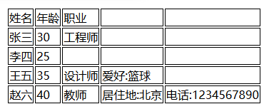

# aliceCSV -- 简洁易用的跨平台csv 模块


**aliceCSV -- 一个简洁易用的跨平台csv模块**。

此模块可以简单地将CSV 文件**作为二维表格**进行操作，并能够轻松地**将它们转换为**其他形式。

它易于使用，没有任何依赖库。比起Python自带的csv库等，它会相对更直观、方便。

## 概述

跨平台的AliceCSV解析软件是一款跨平台、跨编程语言的对CSV文件进行操作的软件，可以把CSV解析为通用的二维列表/数组，简化了软件开发中对CSV文件操作的过程。软件还包含格式纠正和格式转换的功能。


软件包含了**C++**、**Python**和**JavaScript**的实现，分别对应嵌入式软件和应用程序、数据处理和网页前端用途，可覆盖大多数开发用途。

软件具有兼容不规范的CSV文件的能力，针对用户在操作CSV文件时常见的错误进行了优化，在发现文件包含格式错误时能__尽可能还原作者原本的意图__。


## 特色

除了简单易用外，aliceCSV的一大特色是 对不符合 RFC 4180 或格式有误的 CSV文件 具有**强大的兼容能力**。

例如，如果有一个名为 “sheet.csv” 的文件，以下是其内容。

```
avc,"She said,"I like orange juice.""
```


这是一种常见的错误。

根据 RFC 4180 定义 7，这种表达是错误的，因为第二个字段中的双引号必须通过在它前面加上另一个双引号来转义。

所以正确的内容如下。

```
avc,"She said,""I like orange juice."""
```


如果你用Excel打开这个错误的csv文件，它会被识别为

> | avc  | She said,I like orange juice."" |
> | ---- | ------------------------------- |
> |      |                                 |

但是，aliceCSV 可以正确识别作者对他们两者的真实意图。

```
from aliceCSV import *
myFile = open("sheet.csv", encoding="utf-8")
print(parseCSV(myFile))
```


它将输出以下结果。

> [['avc', 'She said,"I like orange juice."']]

不必担心这种兼容会影响正常的读取——举个例子，如果要表达上面Excel读取出的错误的结果，也不应该是那种错误的写法，这种什么都不是的写法只能通过解读程序猜测来读取，至于猜成什么，因文本、解读程序的不同，也是不确定的。

aliceCSV只是根据常见错误，选择猜成比较可能是作者真实意图的结果进行输出罢了。

## 安装

### Python

您可以使用 pip 来安装它。

```
pip install aliceCSV
```

或从此存储库下载。

### C++

下载此存储库提供的cpp文件

### JavaScript

使用存储库中提供的`aliceCSV_1.0.1.js`即可

## 如何使用


### 1. 解析CSV文件内容为二维列表

```
parseCSV(csv_text, [可选]delimiter)
```

> csv_text：要解析的CSV文件文本。
> delimiter : CSV文件的分隔符，可以不填，默认为","。


**警告：**

1.如果你发现无法正确处理像这样的CSV文件，这可能是因为在分隔符","后面多了一个空格，所以实际上分隔符是", "。

```
name, gender, height, address
John, male, 175cm, "123 Main Street, New York, USA"
Emily, female, 160cm, "45 Oxford Road, London, UK"
Michael, male, 180cm, "10 Rue de la Paix, Paris, France"
Sophia, female, 165cm, "25 Alexanderplatz, Berlin, Germany"
```


如果您修复它或了解更多信息，您可以转到第四部分 [**4.将 CSV 文件转换为其他格式**](https://github.com/Alicedrop/aliceCSV/blob/main/README.md#4convert-csv-files-into-other-formats) .


### 2. 解析CSV文件的其中一行

用户可使用软件的parseLine函数来解析CSV文件的单独某一行。 

```
parseLine(line, delimiter)
```

> line：CSV文件某一行的文本。
> delimiter：解析时选择的分隔符。可以不填，默认为”,”。


### 3. 将表格输出为CSV文件

writeCSV函数可以将二维列表表示的表格保存为CSV文件。

 

注意，由于各编程语言的IO逻辑不同，不同实现存在一定差异：

与Python和C++实现不同，JavaScript实现的writeCSV函数返回一个blob形式的CSV文件，而不是直接写入到硬盘。

函数需要的参数和对应的含义如下： 

```
writeCSV(sheet, [可选]output_path, [可选]delimiter, [可选]sheet_encoding, [可选]line_break)
```

> sheet：需要保存的二维列表。
> output_path: 输出路径。可以不填，默认为在当前目录下创建"output.csv"。
> sheet_encoding: 输出文件的编码格式。可以不填，默认为“utf-8"。
> delimiter: CSV文件所使用的分隔符。可以不填，默认为","。
> line_break: 输出文件使用的换行符。可以不填，默认为"\n"。

### 4. 修复CSV文件中出现的长度问题

由于种种原因，一些CSV文件每行的字段数不一样，这不符合常用的RFC 4180规范，在一些场景下可能会引发问题。用户可以使用软件的fixLineLength函数使得每行字段数相同。

函数需要的参数和对应的含义如下： 

```
fixLineLength (csv_sheet)
```

> csv_sheet：二维列表表示的表格。

例如，下面这个表格各行长度不同。

 

我们可以使用fixLineLength进行修复


把结果保存为CSV文件再打开，可以看到表格的每一行长度都变为了5。

 


### 5. 格式转换

软件的fixCSV函数可以把CSV文件保存为各种兼容格式的CSV文件，包括改为使用其他分隔符、文件编码、换行符等。

例如，对于一个分隔符是”.”的CSV文件，可以使用fixCSV函数把它转换为常见的以逗号为分隔符的CSV文件。

 

如图，使用Python实现的fixCSV函数，输入源文件地址和源文件分隔符，即可在当前路径输出转换成的“output.csv”。


**注意，同样由于各编程语言IO操作的逻辑不同，不同实现可能会有一定差异。**

**在JavaScript实现中，fixCSV函数返回的是一个Promise，用户解析这个Promise即可得到blob形式的转换后的文件。**

输入两个参数即可进行简单转换。可以根据实际需要输入更多参数。

函数需要的参数和对应的含义如下：

```
 fixCSV(path, [可选]output_path,[可选]origin_delimiter, [可选]target_delimiter, [可选]origin_encoding)
```

> path: 输入的初始CSV文件路径.
>
> output_path: 输出生成的CSV文件的路径。可以不填，默认为“output.csv”。JavaScript实现没有这一参数。
>
> origin_delimiter：原始CSV文件的分隔符。可以省略，默认值为“,”。
>
> target_delimiter：输出文件中使用的分隔符。可以省略，默认值为“,”。
>
> origin_encoding：原始文件的编码。可以省略，默认值为“utf-8”。
>
> target_encoding：输出文件中使用的编码。可以省略，默认值为“utf-8”。
>
> target_line_break：输出文件的换行符。可以省略，默认值为“\n”。


## 许可证

此项目前身为[aliceCSV v0.1.3](https://github.com/Alicedrop/aliceCSV)

此存储库中的 aliceCSV 代码使用 MIT 许可证，请参阅我们的文件。`LICENSE`